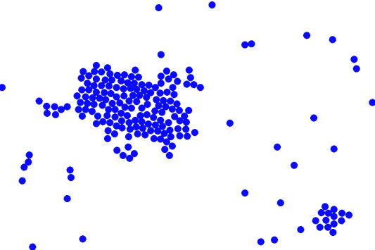
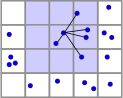

# 2D molecular dynamics

Toy 2D molecular dynamics simulation written in Rust.

The atoms interact according to a [Lennard-Jones](https://en.wikipedia.org/wiki/Lennard-Jones_potential) potential, a good approximation for noble gasses like argon. However for educational purposes, the motion is constrained to 2 dimensions. This allows to clearly visualize the dynamics.

Calculating the force on each atom is accelerated by placing the atoms on a grid, and only considering interactions between atoms in directly adjacent cells. This gives an accurate result if the grid size is chosen so that the interaction force has fallen off to nearly zero at a distance of one cell. 2.5 times the characteristic interaction scale is a common choice.

After the forces have been calculated, the velocities and positions are updated using a [Velocity Verlet](https://en.wikipedia.org/wiki/Verlet_integration) integrator. Finally, a visualization is rendered in real-time using SDL.